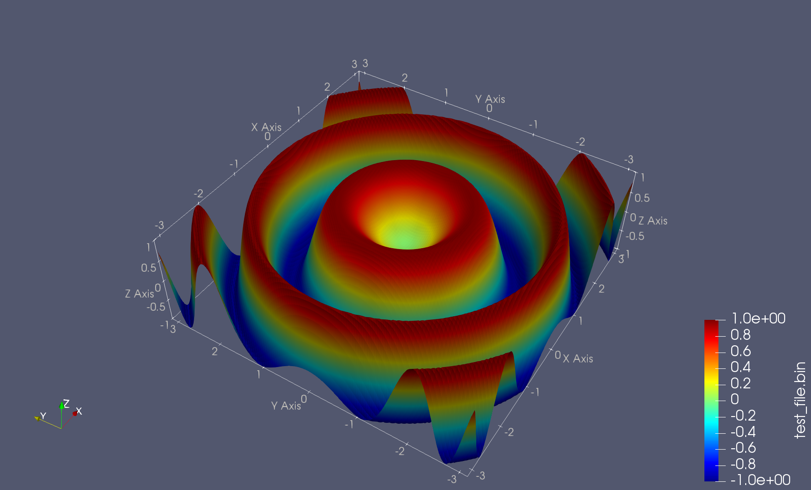

# About this Reader
This filter reads in float or double data that is packed into a binary file format. It will treat the data as one long array and make a vtkTable with one column of that data. The reader uses big endian and defaults to import as floats. Use the 'Table to Uniform Grid' or the 'Reshape Table' filters to give more meaning to the data. We chose to use a vtkTable object as the output of this reader because it gives us more flexibility in the filters we can apply to this data down the pipeline and keeps thing simple when using filters in this repository.

There is a checkbox you can use to specify double precision if needed and a text box where you can specify the data variable name. The default for the data variable name is the base name of the file, however you may want something less verbose or more specific.

## Common Filters to Use Down the Pipeline
- [Table to Uniform Grid](Table-to-Uniform-Grid)
- [Reshape Table](Reshape-Table)
- [Table to Points](https://www.paraview.org/Wiki/ParaView/Users_Guide/List_of_filters#Table_To_Points)
- [Table to Structured Grid](https://www.paraview.org/Wiki/ParaView/Users_Guide/List_of_filters#Table_To_Structured_Grid)
- [Normalize Array](Normalize-Array)


# Example Use
For an example of how to use this reader, lets make our own test file of packed floats in binary format. Run this script outside of ParaView to create a test file. It will compute a ripple function and write out all the `Z` data as packed floats.

```py
import struct
import numpy as np

# The 2D space we are working with
step = np.pi/64.
x = y = np.arange(-np.pi,np.pi + step, step)
X, Y = np.meshgrid(x,y)

# A cool looking ripple function
def f(x,y):
    return np.sin((x**2 + y**2))

# Compute the values of the ripple function in our space
Z = np.zeros(np.shape(X), dtype=np.float32)
for i in range(len(x)):
    for j in range(len(y)):
        Z[i,j] = f(X[i,j],Y[i,j])

# Parameters for a 'Table to Uniform Grid' filter
print("Shape of grid (n1,n2,n3): ", np.shape(Z))
print("Spacing for all axii: ", step)
print("Origin (x,y,z): ", (np.min(x),np.min(y),0.0))


#---- Export Data ----#
# NOTE: Copy and paste the code below for your needs

# Flatten the matrix in C-Contiguous manner
Z = Z.flatten()

## Choose floats or doubles ##
# Pack as FLOATs:
data = struct.pack('>'+str(len(Z))+'f',*Z)
# Or pack as DOUBLEs:
#   (be sure to enable the 'Double Values' checkbox
#   on the reader when loading into ParaView)
#data = struct.pack('>'+str(len(Z))+'d',*Z)

# Open file to write binary data
f = open('~/test_file.bin', 'wb')
# Write out the packed data in binary format
f.write(data)
# Close the file
f.close()
```
Now select 'File->Open...' within ParaView and choose `test_file.bin` wherever you saved it. This reader will unpack the floats and load them into a table. You can now use this data in many ways. For example, apply a 'Table to Uniform Grid' filter (from this repository) and set the filter parameters to the information in the print out from when you ran the script above. Once you have vtkImageData made of the data, you can apply a 'Warp by Scalar' filter for a fun visualization effect to see 3D ripples like the image below!


