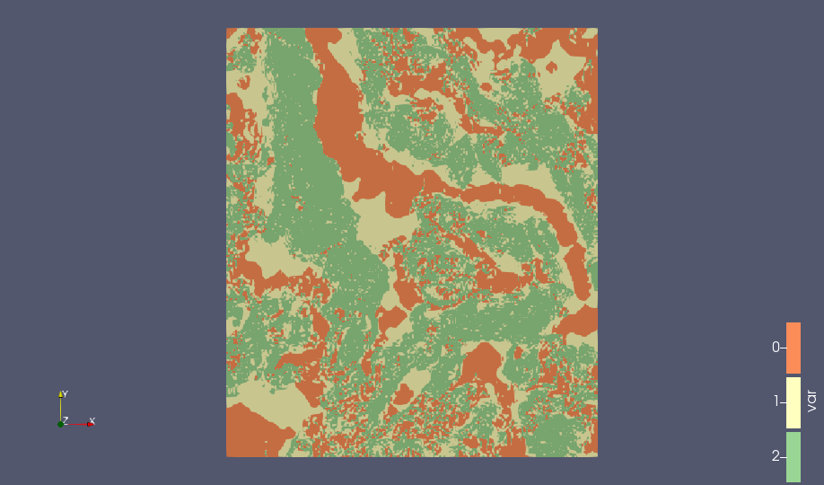
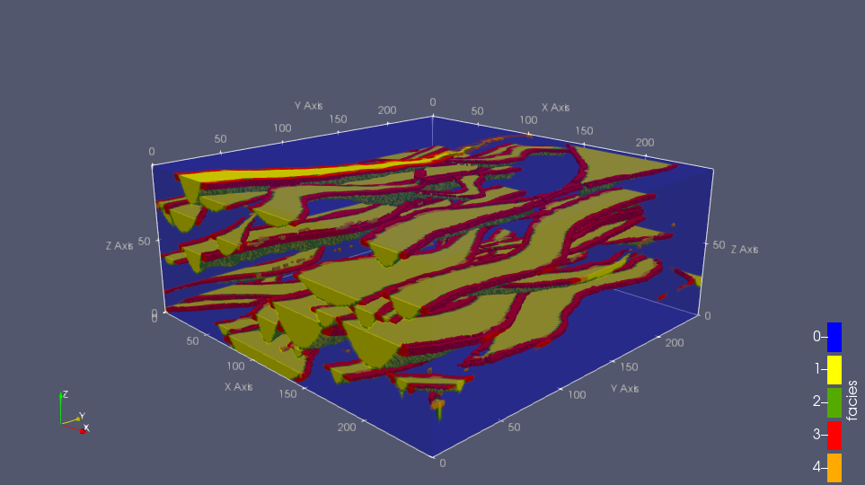

# About this Reader
The Stanford Geostatistical Modeling Software (SGeMS) ASCII format is much like the [GSLIB](Read-GSLIB-File-to-Table.md) file format. The reader we have developed for this format assumes the data to be defined on a regularly spaced grid and that the first line of the file will specify the dimensions of that grid. The output of this file reader is a vtkImageData object which is essentially a regularly spaced grid with varying dimensionality along each axis. The reader will only work if the format of the file strictly follows what is below. If your SGeMS file does not strictly follow the uniform grid format below then we recommend use the [GSLIB](Read-GSLIB-File-to-Table.md) file reader.

# File Format
The general format is as follows:

```txt
n1 n2 n3
numberOfColumns
Col1_name
Col2_name
Col3_name
dataCol1 dataCol2 dataCol3
dataCol1 dataCol2 dataCol3
dataCol1 dataCol2 dataCol3
dataCol1 dataCol2 dataCol3
dataCol1 dataCol2 dataCol3
...
```

An example file might look something like this, where we have a 400 by 150 by 40 (x by y by z) grid with uniform spacing along each axis with three data arrays:

```txt
400 150 40
3
Variable1
Variable2
Variable3
0.908793985844 -0.141859993339 0.76693302393
0.909209012985 0.0264630001038 0.935671985149
0.908389985561 -0.0224980004132 0.885891973972
0.906355023384 -0.0762720033526 0.83008402586
0.895779013634 0.0125150000677 0.908294022083
0.876645028591 -0.0550080016255 0.821636974812
0.856096029282 0.0719339996576 0.928031027317
...
```
## Common Filters to Use Down the Pipeline
- [Translate Origin of Grid](../Filters/Translate-Origin-of-Grid.md)
- [Flip Grid Axii](../Filters/Flip-Grid-Axii.md)
- [Normalize Array](../Filters/Normalize-Array.md)
- [Contour](https://www.paraview.org/Wiki/ParaView/Users_Guide/List_of_filters#Contour)
- [Threshold](https://www.paraview.org/Wiki/ParaView/Users_Guide/List_of_filters#Threshold)

# Example Use
For example files to use with this reader, download any of the 2D or 3D files from [this website](http://www.trainingimages.org/training-images-library.html) and load them into ParaView using the 'Read SGeMS File to Uniform Grid' file reader. A 2D or 3D block of data should automatically be built and visualized.

Here is the [Walker Lake Exhaustive DEM Categorized](http://www.trainingimages.org/uploads/3/4/0/5/3405352/a_wlreferencecat.zip) with a categorized color scale:



and here is the [FLUVSIM object-based model](http://www.trainingimages.org/uploads/3/4/0/5/3405352/ti_fluvsim_big_channels3d.zip) with a categorized color scale (bounding surfaces are set to be transparent):



We will later add in the ability to specify the spacing and origin of the produced vtkImageData as advanced properties of this reader, however you can easily do this by adding a Python Programmable Filter that copies the data and changes these properties with a script like this one:

```py
# Note: Set the output type to vtkImageData
pdi = self.GetInput() # vtkImageData
pdo = self.GetOutput() #vtkImageData
# DeepCopy so that we do not disturb the input data
pdo.DeepCopy(pdi)
# x, y, z origin
pdo.SetOrigin(x_origin, y_origin, z_origin)
# spacing for each axial direction
pdo.SetSpacing(x_spacing, y_spacing, z_spacing)
```
